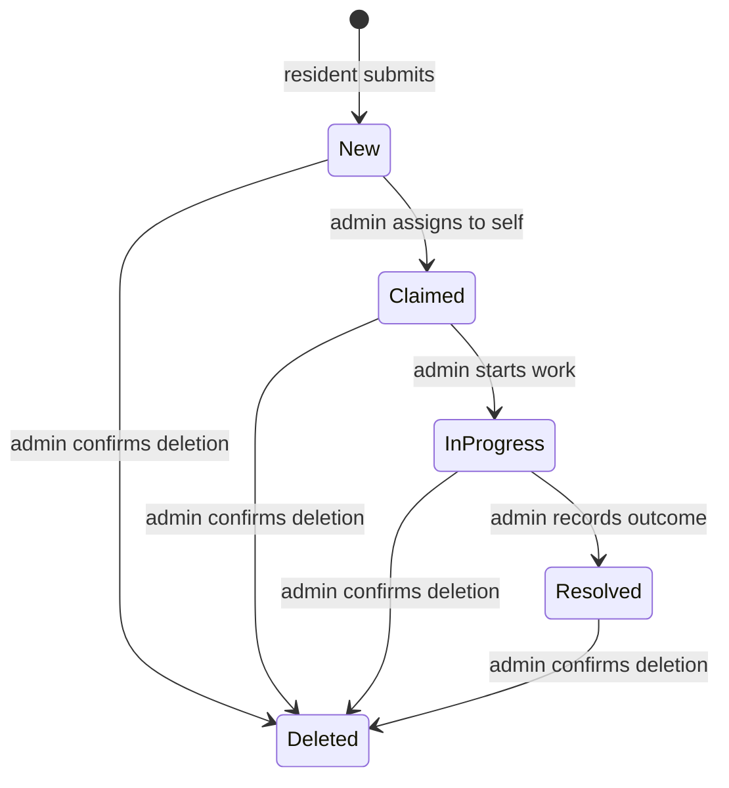
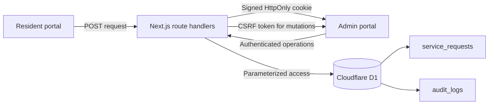

# CivicFlow

CivicFlow is a full-stack community service request tracker built as a portfolio project. It turns a resident report into a structured operations workflow: submission, ownership, active work, resolution, reporting, and an audit trail.

[**Open the public live demo**](https://civicflow-request-tracker.muznaimran328.chatgpt.site)

> **Portfolio notice:** CivicFlow is an independent educational project. It is not affiliated with UNDP, a government agency, or a public service provider. The supplied deployment and credentials are intended for synthetic data only.

## Product at a glance

### Resident portal

- Opens without an account or password.
- Guides a resident through a focused request form.
- Captures a title, service category, priority, general location, and description.
- Avoids asking for names, contact details, or exact home addresses.
- Validates the request on both the client and server.
- Returns an opaque public reference after a successful submission.
- Includes a hidden honeypot field to reduce automated form spam.

### Administrator portal

- Requires a server-validated administrator session.
- Summarizes total, new, active, and resolved requests.
- Searches and filters the queue by status, category, and priority.
- Shows responsive desktop and mobile queue views.
- Lets an administrator claim a request, start work, add an internal note, and resolve it with a required outcome note.
- Requires confirmation before permanently deleting a request.
- Retains a minimal audit event after deletion.
- Displays recent workflow activity and demand by service category.
- Exports an operations-safe CSV report.

### Workflow



## Demo access

| Role | How to enter | Capabilities |
| --- | --- | --- |
| Resident | Choose **Resident**; no credentials are required | Submit one service request and receive a reference |
| Administrator | Username `admin`, password `admin` | Review, filter, claim, update, resolve, delete, and export requests |

The `admin` / `admin` credential is deliberately visible so reviewers can explore the portfolio deployment. It is unsuitable for real data or public operations. Before any production use, replace shared credentials with individual accounts through an identity provider, add authorization roles, rate-limit login and submission routes, rotate a strong session secret, and establish a data retention policy.

## Architecture



The browser never stores administrator credentials or session data in local storage. The server issues a signed, time-limited, HttpOnly session cookie. Administrator mutations also require a matching CSRF token. D1 is the source of truth for requests and audit history.

## Technology

| Layer | Technology |
| --- | --- |
| UI | React 19, TypeScript, Tailwind CSS 4, Shadcn UI primitives, Lucide icons |
| Application framework | Next.js 16 app structure running through Vinext |
| API | Next.js route handlers deployed as a Cloudflare Worker |
| Data | Cloudflare D1 (SQLite) with Drizzle ORM schema and migrations |
| Validation and security | Server validation, signed session cookies, CSRF checks, same-origin checks, honeypot spam control |
| Reporting | Live operational metrics, category distribution, audit activity, filtered queue, CSV export |
| Agent interoperability | A browser Model Context Protocol tool for synthetic resident submissions |
| Hosting | OpenAI Sites build workflow on Cloudflare infrastructure |

## Local setup

### Prerequisites

- Node.js 22.13 or newer
- npm
- Git, if you want to clone or publish the repository

### 1. Install the project

```bash
git clone https://github.com/MuznaImran/civicflow-service-request-tracker.git
cd civicflow-service-request-tracker
npm ci
```

### 2. Create local environment settings

On PowerShell:

```powershell
Copy-Item .env.example .env.local
```

On macOS or Linux:

```bash
cp .env.example .env.local
```

The included values preserve the reviewable portfolio login. Change them before using anything other than synthetic data. `SESSION_SECRET` should be a long random value outside a portfolio-only environment.

### 3. Generate and apply the D1 migration

Generate a migration after changing [db/schema.ts](db/schema.ts):

```bash
npm run db:generate
```

Build once so Wrangler has the generated Worker configuration:

```bash
npm run build
```

For a fresh local database, apply the committed initial migration:

```bash
node --import ./scripts/sites-env.mjs ./node_modules/wrangler/bin/wrangler.js d1 execute DB --local --config dist/server/wrangler.json --persist-to .wrangler/state --file drizzle/0000_civicflow_initial_schema.sql
```

Apply future migration files in filename order. Do not replay a migration that has already been applied to the same local state directory.

### 4. Run the development server

```bash
npm run dev
```

Open [http://127.0.0.1:5173](http://127.0.0.1:5173). The first administrator queue load adds a small set of clearly synthetic sample requests when the database is empty.

### 5. Verify a production build

```bash
npm run lint
npm run build
npm start
```

`npm start` previews the built Worker locally and reuses `.wrangler/state` for D1.

## API surface

| Method | Route | Access | Purpose |
| --- | --- | --- | --- |
| `POST` | `/api/requests` | Public | Validate and create a resident request |
| `POST` | `/api/admin/login` | Public | Validate administrator credentials and start a signed session |
| `GET` | `/api/admin/session` | Administrator session | Restore the current session and return a CSRF token |
| `POST` | `/api/admin/logout` | Administrator session + CSRF | Clear the administrator session |
| `GET` | `/api/admin/requests` | Administrator session | Return the request queue and recent audit events |
| `PATCH` | `/api/admin/requests/:id` | Administrator session + CSRF | Claim, start, resolve, or add an internal note |
| `DELETE` | `/api/admin/requests/:id` | Administrator session + CSRF | Delete a request and retain a minimal audit event |
| `GET` | `/api/admin/export` | Administrator session | Download an operations-safe CSV export |

All JSON API responses disable caching. Public creation returns only the generated reference, current status, and creation time. The resident portal does not expose a public queue or request lookup endpoint.

## Project map

```text
.
├── .openai/hosting.json        # Sites project and D1 binding declaration
├── app/
│   ├── api/                    # Public and authenticated route handlers
│   ├── chatgpt-auth.ts         # Optional Sites sign-in helper supplied by the starter
│   ├── civicflow-app.tsx       # Role chooser, resident flow, admin UI, and MCP registration
│   ├── globals.css             # Design tokens, type, grid, hero, and motion rules
│   ├── layout.tsx              # Metadata, favicon, and root document shell
│   └── page.tsx                # Application entry page
├── build/                      # Sites/Vite build integration supplied by the starter
├── components/ui/              # Reusable Shadcn UI primitives
├── db/
│   ├── index.ts                # D1 binding and typed Drizzle client
│   └── schema.ts               # Request and audit table definitions
├── docs/
│   ├── data-dictionary.md      # Data fields, enums, indexes, and API representations
│   ├── file-map.md             # Detailed responsibility for every source/support area
│   ├── product-requirements.md # Personas, requirements, acceptance criteria, and roadmap
│   └── screenshots/README.md   # Portfolio screenshot capture plan
├── drizzle/                    # Generated, reviewable SQL migrations and metadata
├── examples/d1/                # Starter D1 example; not part of the CivicFlow runtime
├── hooks/                      # Shared responsive UI hook supplied by the starter
├── lib/
│   ├── server/                 # Auth, validation, HTTP, and request data helpers
│   └── utils.ts                # Shared class-name utility
├── public/                     # Favicon and static assets
├── scripts/                    # Portable install, build, preview, and Sites environment helpers
├── vendor/                     # Pinned Shadcn/Tailwind stylesheet and license
├── .env.example                # Safe environment-variable template
├── cloudflare-env.d.ts         # Type declarations for Worker bindings and secrets
├── components.json             # Shadcn component configuration
├── drizzle.config.ts           # Drizzle migration generator configuration
├── eslint.config.mjs           # Lint configuration
├── next.config.ts              # Next/Vinext application configuration
├── package.json                # Dependencies and project scripts
├── postcss.config.mjs          # Tailwind/PostCSS integration
├── tsconfig.json               # Strict TypeScript configuration and aliases
└── vite.config.ts              # Vinext, Sites, and local Cloudflare binding configuration
```

The UI library contains both components used by CivicFlow and additional starter primitives for future work. Runtime application code lives in `app/`, `db/`, and `lib/server/`; generated dependencies and local state are ignored by Git.

## Portfolio evidence

CivicFlow demonstrates practical digital product and operations skills:

- Translating a service problem into resident and administrator journeys.
- Defining product requirements, field validation, and acceptance criteria.
- Designing an accountable lifecycle with ownership and resolution evidence.
- Coordinating a typed React frontend with authenticated server routes.
- Modeling relational data and managing versioned database migrations.
- Turning operational records into metrics, filters, audit activity, and CSV reporting.
- Documenting security boundaries, data minimization, deployment, and future work.
- Building responsive loading, empty, error, confirmation, and destructive-action states.

These points describe the work demonstrated in this repository. They do not imply experience with, endorsement by, or affiliation with any organization.

## Publish to GitHub

1. Create an empty GitHub repository, for example `civicflow-service-request-tracker`.
2. Confirm that `.env.local`, `.wrangler/`, `.sites-runtime/`, `.vinext/`, `dist/`, and `node_modules/` remain ignored.
3. Initialize and push from this project directory:

```bash
git init
git add .
git commit -m "Build CivicFlow service request tracker"
git branch -M main
git remote add origin <your-github-repository-url>
git push -u origin main
```

4. Add screenshots using the naming and capture guidance in [docs/screenshots/README.md](docs/screenshots/README.md).
5. Add the deployed portfolio URL to the GitHub repository description and the top of this README.
6. Never commit real administrator credentials, production secrets, resident information, or local D1 state.

## Product documentation

- [Product requirements](docs/product-requirements.md)
- [Data dictionary](docs/data-dictionary.md)
- [Complete file map](docs/file-map.md)
- [Screenshot plan](docs/screenshots/README.md)

## License

Released under the [MIT License](LICENSE).
